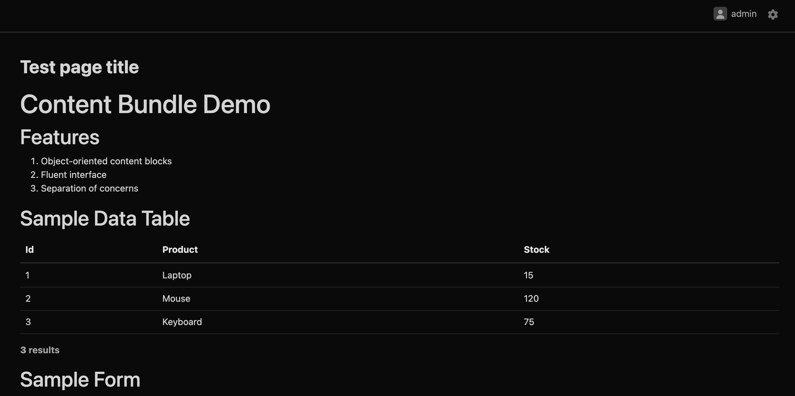

### EasyadminContentBundle Documentation

This document provides an overview of the `EasyadminContentBundle` and instructions on how to use its core components to
build content programmatically.



#### 0. Instalation

`composer require wertelko/easyadmin-content-bundle`

#### 1. Introduction

The `EasyadminContentBundle` is designed to simplify the creation of structured content blocks within your Symfony
controllers. Instead of writing raw HTML or complex logic in your Twig templates, you can use a fluent, object-oriented
API to define content elements like headings, lists, tables, and forms.

This is particularly useful for building admin dashboards, reports, or any page where the structure is defined by the
backend logic.

#### 2. Core Concepts

The bundle is built around the concept of `Content` objects. Each type of content (e.g., a heading or a table) is
represented by a specific class that extends the base [
`Content`](psi_element://Wertelko\EasyadminContentBundle\Content\Content) class.

- **[`Content` class](psi_element://Wertelko\EasyadminContentBundle\Content\Content)**: The base class for all content
  blocks. It holds a `ContentDto` which carries the data and rendering options to the template.
- **`ContentDto`**: A Data Transfer Object that stores the content itself, the path to the Twig template for rendering,
  and other display options.
- **Static Factory `new()`**: All content classes have a static factory method [
  `new()`](psi_element://Wertelko\EasyadminContentBundle\Content\Content#new) for cleaner, more readable instantiation.

#### 3. Content Types

The bundle provides several predefined content types.

##### 3.1. `HeadingContent`

Used to create HTML heading elements (`<h1>` to `<h6>`).

- **Class**: [`HeadingContent`](psi_element://Wertelko\EasyadminContentBundle\Content\HeadingContent)
- **Usage**: Create an instance with the heading text and then use a fluent method to set the heading level.

```php
use Wertelko\EasyadminContentBundle\Content\HeadingContent;

// Creates an <h2> element
$heading = HeadingContent::new('My Page Title')->asH2();
```

- **Methods**: [`asH1()`](psi_element://Wertelko\EasyadminContentBundle\Content\HeadingContent#asH1), [
  `asH2()`](psi_element://Wertelko\EasyadminContentBundle\Content\HeadingContent#asH2), [
  `asH3()`](psi_element://Wertelko\EasyadminContentBundle\Content\HeadingContent#asH3), [
  `asH4()`](psi_element://Wertelko\EasyadminContentBundle\Content\HeadingContent#asH4), [
  `asH5()`](psi_element://Wertelko\EasyadminContentBundle\Content\HeadingContent#asH5), [
  `asH6()`](psi_element://Wertelko\EasyadminContentBundle\Content\HeadingContent#asH6).

##### 3.2. `ListContent`

Used to render an unordered (`<ul>`) or ordered (`<ol>`) list.

- **Class**: [`ListContent`](psi_element://Wertelko\EasyadminContentBundle\Content\ListContent)
- **Usage**: Pass an array of items to the constructor. By default, it creates a `<ul>`.

```php
use Wertelko\EasyadminContentBundle\Content\ListContent;

// Creates a <ul> list
$list = ListContent::new(['First item', 'Second item', 'Third item']);

// Creates an <ol> list
$orderedList = ListContent::new(['Step 1', 'Step 2'])->asOrdered();
```

- **Methods**: [`asUnordered()`](psi_element://Wertelko\EasyadminContentBundle\Content\ListContent#asUnordered) (
  default), [`asOrdered()`](psi_element://Wertelko\EasyadminContentBundle\Content\ListContent#asOrdered).

##### 3.3. `TableContent`

Used to render a data table.

- **Class**: [`TableContent`](psi_element://Wertelko\EasyadminContentBundle\Content\TableContent)
- **Usage**: Pass an array of associative arrays. The keys of the first item are used as table headers by default.

```php
use Wertelko\EasyadminContentBundle\Content\TableContent;

$data = [
    ['id' => 1, 'name' => 'Product A', 'price' => 100],
    ['id' => 2, 'name' => 'Product B', 'price' => 150],
];

// Creates a table with headers 'id', 'name', 'price'
$table = TableContent::new($data);

// Creates a table without headers
$tableNoHeaders = TableContent::new($data)
    ->setHeaders(['Product ID', 'Product', 'Price']) // Set custom headers
    ->disableHeaders(); // Disable headers
```

- **Methods**: [
  `disableHeaders(bool $disabled = true)`](psi_element://Wertelko\EasyadminContentBundle\Content\TableContent#disableHeaders).

##### 3.4. `FormContent`

Used to render a Symfony Form.

- **Class**: [`FormContent`](psi_element://Wertelko\EasyadminContentBundle\Content\FormContent)
- **Usage**: Pass a `FormView` or a `Form` object to its constructor. It will automatically create the `FormView` if
  needed.

```php
use Wertelko\EasyadminContentBundle\Content\FormContent;

// Assuming $form is a Symfony Form object created in your controller
$formContent = FormContent::new($form);
```

#### 4. Rendering in Twig

To render the content blocks, you would pass them to your Twig template and iterate over them, using a (hypothetical)
custom Twig function like `render_content`.

```twig
{# Assumes 'contents' is an array of Content objects #}

    {{ render_content(content) }}

```

---

### Implementation Plan

Here is a plan to demonstrate the usage of your bundle with a complete example.

1. **Create a simple Form Type**: We'll create a `TaskType.php` to demonstrate the [
   `FormContent`](psi_element://Wertelko\EasyadminContentBundle\Content\FormContent).
2. **Create the `TestController`**: This controller will build a page using all the different content types (`Heading`,
   `List`, `Table`, and `Form`).

### Step 1: Create a Form Type

This is a standard Symfony form type that we will use in our controller example.

```php:/Users/aleksey/Dev/Sites/polyhost/src/Form/TaskType.php
<?php

namespace App\Form;

use Symfony\Component\Form\AbstractType;
use Symfony\Component\Form\Extension\Core\Type\SubmitType;
use Symfony\Component\Form\Extension\Core\Type\TextType;
use Symfony\Component\Form\FormBuilderInterface;

class TaskType extends AbstractType
{
    public function buildForm(FormBuilderInterface $builder, array $options): void
    {
        $builder
            ->add('name', TextType::class, [
                'label' => 'Task Name',
                'attr' => ['placeholder' => 'Enter the task name...']
            ])
            ->add('save', SubmitType::class, [
                'label' => 'Create Task'
            ]);
    }
}
```

### Step 2: Create the `TestController`

This controller demonstrates how to instantiate and combine different content blocks to build a complete page.
This controller should implements `EasyadminContentControllerInterface` and use `EasyAdminContentTrait`

```php:/Users/aleksey/Dev/Sites/polyhost/src/Controller/TestController.php
<?php

namespace App\Controller;

use App\Form\TaskType;
use Symfony\Bundle\FrameworkBundle\Controller\AbstractController;
use Symfony\Component\Form\FormFactoryInterface;
use Symfony\Component\HttpFoundation\Response;
use Symfony\Component\Routing\Annotation\Route;
use Wertelko\EasyadminContentBundle\Content\FormContent;
use Wertelko\EasyadminContentBundle\Content\HeadingContent;
use Wertelko\EasyadminContentBundle\Content\ListContent;
use Wertelko\EasyadminContentBundle\Content\TableContent;
use Wertelko\EasyadminContentBundle\EasyadminContentControllerInterface;
use Wertelko\EasyadminContentBundle\Trait\EasyAdminContentTrait;

class TestController extends AbstractController implements EasyadminContentControllerInterface
{
    use EasyAdminContentTrait;
    
    #[Route('/test', name: 'app_test')]
    public function index(FormFactoryInterface $formFactory): Response
    {
        $contents = [];

        // 1. Add a main heading
        $contents[] = HeadingContent::new('Content Bundle Demo')->asH1();

        // 2. Add a subheading and an ordered list
        $contents[] = HeadingContent::new('Features')->asH2();
        $contents[] = ListContent::new([
            'Object-oriented content blocks',
            'Fluent interface',
            'Separation of concerns',
        ])->asOrdered();

        // 3. Add a table of data
        $contents[] = HeadingContent::new('Sample Data Table')->asH2();
        $tableData = [
            ['id' => 1, 'product' => 'Laptop', 'stock' => 15],
            ['id' => 2, 'product' => 'Mouse', 'stock' => 120],
            ['id' => 3, 'product' => 'Keyboard', 'stock' => 75],
        ];
        $contents[] = TableContent::new($tableData)
            ->setHeaders(['Product ID', 'Product', 'Price']);

        // 4. Add a Symfony form
        $contents[] = HeadingContent::new('Sample Form')->asH2();
        $form = $formFactory->create(AiPromptType::class);
        $contents[] = FormContent::new($form);


        return $this->renderContent($contents, 'Test page title');
    }
}
```

Go to the http://localhost:8000/admin?routeName=app_test